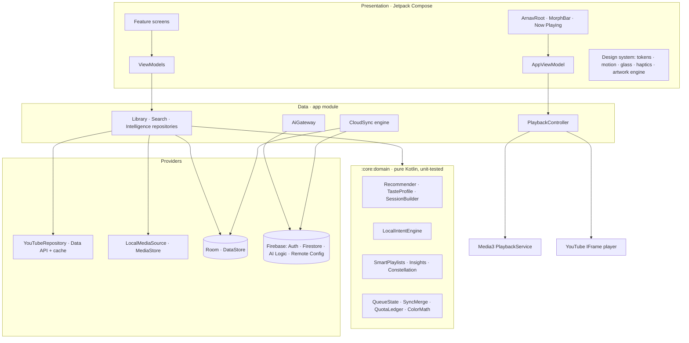

<div align="center">

# Arnav Music
**Music, alive.**

A premium, local-first Android music experience: YouTube discovery through official APIs, your own on-device library with full background playback, and an on-device intelligence layer called **Arnav AI**.


[**Download the latest APK →**](../../releases/latest)

</div>

---

## Contents
1. [What it is](#what-it-is)
2. [Screenshots](#screenshots)
3. [Features](#features)
4. [Zero-cost guarantee & limits](#zero-cost-guarantee--limits)
5. [Architecture](#architecture)
6. [Tech stack](#tech-stack)
7. [Getting started](#getting-started)
8. [Build & release](#build--release)
9. [Privacy](#privacy)
10. [YouTube policy compliance](#youtube-policy-compliance)
11. [Known limitations](#known-limitations)
12. [Roadmap](#roadmap)
13. [License & attribution](#license--attribution)

## What it is
Arnav Music is an **independent** app that combines:

| Source | How it plays | Background playback |
|---|---|---|
| **YouTube** (search, trending, playlists) | Official embedded **YouTube IFrame player**, always visible, ads and attribution intact | No — YouTube's terms don't allow hidden playback. One tap hands off to YouTube Music. |
| **Your device** (MP3, FLAC, M4A, OGG, WAV… via MediaStore) | Native **Media3/ExoPlayer** | Yes — notification, lock screen, Bluetooth, headset, gapless |

Everything around playback — library, history, recommendations, Taste DNA, Moments, Arnav AI — works the same for both, because the UI only talks to a source-agnostic `PlaybackController` and reads `PlaybackCapabilities`.

## Screenshots
> Placeholders — add device captures here.

| Home | Now Playing | Arnav AI | Taste DNA |
|---|---|---|---|
| _home.png_ | _player.png_ | _ai.png_ | _dna.png_ |

## Features

**Signature experiences**
- **MorphBar → Now Playing**: one continuous spatial transformation. The artwork (or the visible YouTube player) physically travels from the mini bar to the hero position; drag up/down to scrub the transition, fling to settle.
- **Dynamic artwork environment**: a deterministic, contrast-guaranteed palette (unit-tested: ≥7:1 text, ≥4.5:1 muted, ≥3:1 accent on every backdrop) tints the player, accent, glass and charts.
- **Living Artwork**: slow light drift, soft orbs and optional gyroscope parallax; fully disabled by Reduce Motion, battery saver or heat.
- **Glass mode**: four optical layers (Thin, Regular, Thick, Elevated) with individual opacity, tint, edge light and elevation; Pure mode is fully opaque and equally polished. Real backdrop blur on Android 12+ where the performance budget allows.
- **Arnav AI sessions**: “45 minutes of energetic coding music, mostly familiar, a few surprises” → structured constraints → real, playable songs → deterministic ordering along an energy curve, with an energy chart and per-track explanations.
- **Moments**: ten immersive procedural environments (Night Drive, Rain, Deep Focus, Golden Hour, Gym…) with their own motion and typography — no images or AI image generation.
- **Taste DNA**: listening clock, week rhythm, discovery/repeat/skip gauges, artist affinity, music age, recent shifts, recaps (day/week/month/year), with stated confidence.
- **Taste Constellation**: your artists as stars, co-listening as light threads; pan, pinch, tap.
- **Listening Timeline & Time Machine**: “Take me back to this day”, “You loved these three months ago”, “Your January era” — only claims the data supports.
- **Queue**: drag-to-reorder with floating lift and neighbour displacement, swipe actions, a **Journey** timeline with ETAs, save queue as playlist.
- **Command palette** (Ctrl/⌘+K on keyboards): commands, moments, settings, search and “Ask Arnav AI …”.

**Everything else**
- Home composed from ≤8 prioritised sections (time-of-day aware); never an empty first launch.
- Explore: moments, trending (1-unit chart call), genres; search with instant local matches, 650 ms debounce, filters, grouped results, saved results, paging, skeletons and intentional error states.
- Library: liked, playlists (Arnav / YouTube / smart, clearly labelled), artists, on-device, history; list/grid/compact; sort; filter; pinning.
- Smart playlists (on device): Heavy Rotation, Forgotten Favorites, Recently Discovered, Most Replayed, Night Owl, Sunday Morning, Never Finished, Fresh Finds, Rediscover.
- Player: seek, shuffle (upcoming only), repeat, sleep timer (5–60 min, end of track, end of queue), output switcher, share cards rendered on device, lyrics only from licensed sources (none scraped).
- Local audio: gapless, fade in/out, skip silence, speed, pause on disconnect, system equalizer.
- Settings: account, appearance, playback, Arnav AI, sources, library, data & sync, notifications, privacy centre, usage & quotas dashboard, accessibility, performance, about/licences, developer panel (debug builds only).
- Adaptive layout: bottom bar on phones, navigation rail and two-pane player on tablets/foldables/landscape.
- Accessibility: TalkBack labels, custom accessibility actions mirroring every gesture, 48 dp targets, font scaling, high contrast, reduced transparency, three motion levels, haptics toggle.
- Deep links: `arnavmusic://track/<videoId>`, `playlist/<id>`, `artist/<name>`, `ai?q=…`, `search?q=…`, `settings/<page>`, `moment/<id>`, plus shared YouTube links.

## Zero-cost guarantee & limits

Arnav Music never requires a credit card, a paid plan or a paid API. It never enables billing on its own.

| Capability | Runs on | What happens when the free limit is reached |
|---|---|---|
| Playback of on-device music | **Device only** | Nothing — no limits |
| Library, likes, playlists, history, queue, settings | **Device (Room/DataStore)** | Nothing — no limits |
| Recommendations, smart playlists, Taste DNA, recaps, constellation, Time Machine | **Device only** (pure Kotlin `:core:domain`) | Nothing — no limits |
| Arnav AI fallback engine (moods, durations, negation, energy curves) | **Device only** | Nothing — always available |
| YouTube search, trending, playlists, metadata | **YouTube Data API v3** with *your* key (default 10,000 units/day) | Searches are cached and reused; near the limit the app conserves (week-old cache counts as fresh); at the limit it serves saved results and explains why. Resets daily. |
| YouTube playback | Official embedded player | Not quota-metered |
| Arnav AI natural-language interpretation | **Gemini Developer API free tier** via Firebase AI Logic | Local per-day cap (default 40, configurable), 4 s throttle, 7-day answer cache. On quota/error the on-device engine answers — sessions still build. |
| Account (Google / email) | **Firebase Auth (Spark)** | Spark limits are far above personal use |
| Cloud sync of likes & playlists | **Cloud Firestore free quota** (50k reads / 20k writes / day) | Writes are dirty-flagged, debounced (4 s) and batched; pulls are incremental (`updatedAt >` last pull). Typical use: tens of operations/day. If exceeded, sync pauses; everything keeps working locally. |
| Remote Config, Analytics (opt-in), App Check | Firebase Spark | Free |

**Things that could require billing in the future (not used):** Cloud Functions, Firebase Storage on Blaze, Crashlytics/Performance Monitoring (left out to avoid build-time plugins and any billing ambiguity), paid Gemini tiers, licensed lyrics providers. None are wired in.

Releases are built with the project's `app/google-services.json` (public client config — the same values ship inside every APK; data is protected by Firestore rules and App Check). Forks without a Firebase config build a fully functional **local-only edition** (no account, no cloud AI).

## Architecture



- **`:core:domain`** has no Android dependencies: models, provider contracts (`MusicCatalogProvider`, `SearchProvider`, `PlaybackProvider`, `LibraryProvider`), recommendation, intent parsing, session building, sync merge rules, queue operations, quota policy, colour correction, formatting. It's unit-tested in CI.
- **`:app`** contains data adapters, playback, DI (Koin), design system and features. Package layout: `core/{ai,common,db,diagnostics,firebase,local,notify,perf,playback,repo,security,settings,youtube}`, `ui/{theme,components,player,artwork,palette}`, `feature/{home,explore,library,collection,ai,moments,insights,profile,settings,auth,onboarding}`.
- **Why Koin instead of Hilt**: no annotation processing on top of Room's KSP, faster builds, and no Kotlin/KSP version coupling — the dependency graph is still one explicit, testable module (`di/AppModule.kt`).
- **Offline-first sync**: Room is the source of truth → optimistic local writes with `dirty` flags and tombstones → debounced batched Firestore writes → incremental pulls → last-write-wins merge where tombstones win ties (`SyncMerge`, unit-tested) → WorkManager retry with backoff.

More detail: [docs/ARCHITECTURE.md](docs/ARCHITECTURE.md).

## Tech stack
Kotlin 2.2 · Jetpack Compose (BOM 2025.08) + Material 3 as a foundation · Navigation Compose · Room 2.7 (KSP) · DataStore · Media3 1.7 · WorkManager · Koin 4.1 · Coil 3 · OkHttp · kotlinx.serialization · Firebase BOM 34 (Auth, Firestore, AI Logic, Remote Config, Analytics, App Check) · Credential Manager + Google ID · android-youtube-player (official IFrame API wrapper) · Manrope (OFL) · R8 + baseline profile.

## Getting started

### Just use it
Download the APK from [Releases](../../releases/latest) and install it (Android 8.0+). On-device music, library, intelligence and Arnav AI's on-device engine work immediately. To search YouTube, paste a free YouTube Data API key in **Settings → Sources** ([guide](docs/YOUTUBE_SETUP.md)).

### Build it yourself
Requirements: JDK 17+, Android Studio (Ladybug or newer) or the command line with the Android SDK (compileSdk 36).

```bash
git clone https://github.com/Arnav-Dugad/Arnav-Music.git
cd Arnav-Music
./gradlew :core:domain:test :app:testDebugUnitTest   # unit tests
./gradlew :app:assembleDebug                         # debug APK
./gradlew :app:assembleRelease                       # R8-optimised release APK
```

Optional local secrets go in `local.properties` (never committed):

```properties
YOUTUBE_API_KEY=your-restricted-android-key
GOOGLE_WEB_CLIENT_ID=1234-abc.apps.googleusercontent.com
```

For cloud features, follow **[docs/FIREBASE_SETUP.md](docs/FIREBASE_SETUP.md)** and put `google-services.json` in `app/`. The build detects it automatically; without it you get the local-only edition.

## Build & release
Every push to `main` or `claude/**` runs **Build & Release** on GitHub Actions: unit tests → R8 release APK → lint → a GitHub Release (`v1.0.<run>`) with the APK and `SHA256SUMS.txt`. Commits containing `[no-release]` build without publishing.

Optional repository secrets (Settings → Secrets → Actions):

| Secret | Purpose |
|---|---|
| `GOOGLE_SERVICES_JSON` | Optional override for the committed `app/google-services.json` (e.g. a different Firebase project) |
| `YOUTUBE_API_KEY` | Built-in key (restrict it to the app's package + SHA-1!) |
| `GOOGLE_WEB_CLIENT_ID` | Web OAuth client id for Google sign-in |
| `ARNAV_KEYSTORE_BASE64`, `ARNAV_KEYSTORE_PASSWORD`, `ARNAV_KEY_ALIAS`, `ARNAV_KEY_PASSWORD` | Private release signing |

Without a private key, releases are signed with the **public community key** in `keystore/` so updates install over each other. It is intentionally public and must not be used for a Play Store listing.

## Privacy
- Listening history, searches, Taste DNA and on-device files **never leave the device**.
- Synced (only when signed in and sync is on): liked YouTube tracks and Arnav playlists, in your private Firestore space, protected by [strict rules](firebase/firestore.rules) with [emulator tests](firebase/tests/rules.test.mjs).
- Arnav AI sends only the text you type, plus (if you allow) your top artist names and style hints.
- Analytics is **off by default**; when on, it records feature usage only — never titles, artists or search text.
- Settings → Privacy shows all of this and lets you clear search history, listening history, AI personalization, disconnect YouTube, delete the cloud profile, or delete the account.
- The user-supplied API key is encrypted with an Android Keystore AES-256-GCM key and excluded from backups. HTTPS only.

## YouTube policy compliance
Arnav Music **does not**: extract stream URLs, use yt-dlp or similar, separate audio from video, block or hide ads, remove attribution, download YouTube content, play YouTube hidden or in the background, spoof clients, or use private YouTube Music endpoints. Playback uses the official IFrame player at ≥ 200 × 200 px with its native controls, paused when the app goes to the background. YouTube data is shown with a YouTube attribution badge. Arnav Music is not affiliated with Google or YouTube.

## Known limitations
- YouTube playback stops when the app is backgrounded (by design; one-tap handoff to YouTube Music).
- With App Check **enforced** on AI Logic, APKs installed from GitHub (not Google Play) usually fail Play Integrity attestation, so Gemini is blocked and Arnav AI uses its on-device engine. Unenforce AI Logic in App Check to allow cloud AI for sideloaded installs, or distribute through Google Play.
- “Energy” and “style” hints for YouTube tracks are estimated from public titles/tags and are labelled as estimates.
- Lyrics show an empty state until a licensed lyrics provider is added.
- No ReplayGain/loudness normalisation (not reliably supported by Media3 across devices); fades and skip-silence are provided instead.
- Baseline profile is hand-written; a generated profile (Macrobenchmark) is on the roadmap.
- Home-screen widgets are on the roadmap.

## Roadmap
See the living list in the latest release notes and [docs/ROADMAP.md](docs/ROADMAP.md).

## License & attribution
Source code © Arnav Dugad. Third-party libraries are Apache 2.0; Manrope is under the SIL Open Font License 1.1 (`app/src/main/assets/licenses`). YouTube is a trademark of Google LLC.
